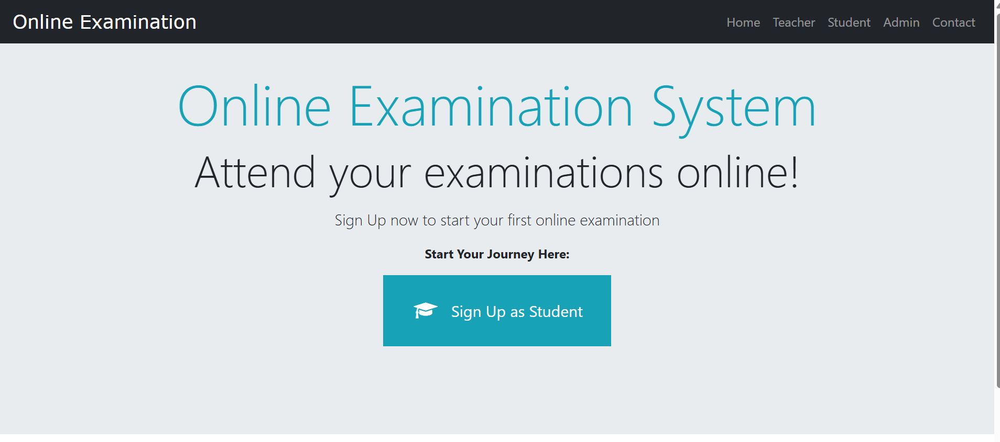

````markdown id="u5f5qc"
# 🚀 Online Examination System using Django Framework

## 📌 Project Overview
The Online Examination System is a web-based application developed using the Django framework. The system automates the examination process by allowing administrators to manage exams, students, questions, and results efficiently. Students can log in, attend exams online, and view results instantly.

This project was developed to understand backend development, database management, REST APIs, and web application deployment using Django.

---

# 🎯 Objective

- Develop a secure online examination platform
- Implement student and admin authentication
- Manage exams, questions, and results digitally
- Create REST APIs using Django REST Framework
- Automate result generation and exam management

---

# 🧰 Technologies Used

- Python
- Django Framework
- Django REST Framework (DRF)
- HTML5
- CSS3
- Bootstrap
- SQLite Database
- Git & GitHub

---

# 🏗️ System Architecture

Student/Admin → Django Web Application → SQLite Database → Result Generation

---

# 📂 Project Structure

```bash
Online-Examination-System/
│
├── exam/
├── student/
├── teacher/
├── templates/
├── static/
├── screenshots/
├── db.sqlite3
├── manage.py
├── requirements.txt
└── README.md
```

---

# ✨ Features

## 👨‍💼 Admin Module
- Admin Login and Dashboard
- Manage Students and Teachers
- Add, Update, and Delete Exams
- Manage Questions and Subjects
- Monitor Student Performance
- View Results

---

## 👨‍🎓 Student Module
- Student Registration and Login
- Attend Online Exams
- View Available Exams
- Instant Result Generation
- Performance Tracking

---

## 📝 Examination Features
- MCQ-Based Online Exams
- Timer-Based Examination System
- Automatic Score Calculation
- Secure Authentication System
- REST API Integration

---

# 🚀 Project Screenshots

## Home Page



---

## Admin Dashboard


---

## Student Dashboard


---

## Examination Page


---

## Result Page


---

# 🚀 Installation Steps

## 1. Clone Repository

```bash
git clone https://github.com/manasi2654/OnlineExaminationSystem.git
cd OnlineExaminationSystem
```

---

## 2. Create Virtual Environment

```bash
python -m venv venv
```

---

## 3. Activate Virtual Environment

### Windows

```bash
venv\Scripts\activate
```

### Linux/Mac

```bash
source venv/bin/activate
```

---

## 4. Install Dependencies

```bash
pip install -r requirements.txt
```

---

## 5. Apply Database Migrations

```bash
python manage.py makemigrations
python manage.py migrate
```

---

## 6. Create Superuser

```bash
python manage.py createsuperuser
```

---

## 7. Run Development Server

```bash
python manage.py runserver
```

Open browser and visit:

```bash
http://127.0.0.1:8000/
```

---

# 🔑 Admin Login

```bash
http://127.0.0.1:8000/admin
```

---

# 📡 REST API Integration

The project includes REST APIs developed using Django REST Framework for:
- Exam Management
- Question Management
- Student Result Handling

---

# 📈 Learning Outcomes

- Learned Django backend development
- Worked with Django REST Framework
- Implemented authentication system
- Managed database operations using SQLite
- Gained hands-on experience with REST APIs
- Improved understanding of full-stack web applications

